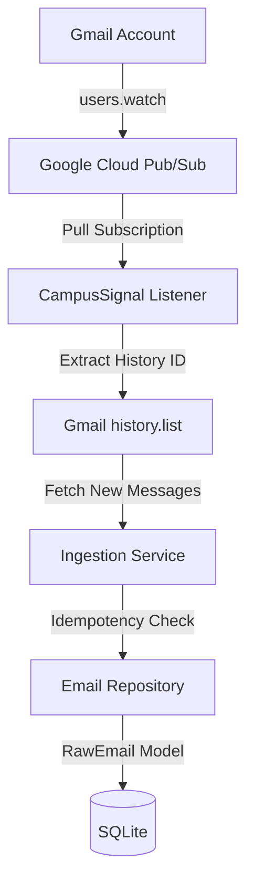
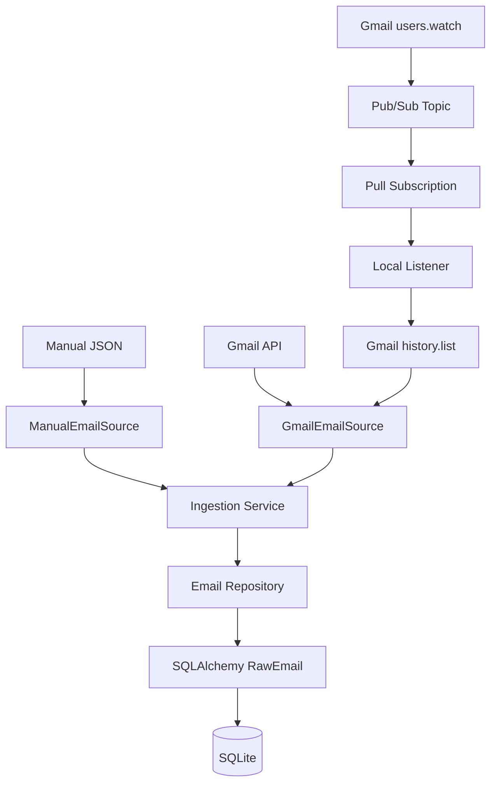

# CampusSignal

CampusSignal is a campus-email processing system that ingests Gmail messages and provides the backend foundation for identifying useful academic, internship, competition, event, and opportunity-related signals from high-volume university email.

## Why I Built It

University inboxes can contain large numbers of:
* academic notices
* club announcements
* competitions
* internships
* events
* administrative communication
* other campus information

Important opportunities can be difficult to identify in a high-volume inbox. CampusSignal explores a software pipeline for ingesting and eventually structuring these signals.

## Current Status

| Component                      | Status         |
| ------------------------------ | -------------- |
| Gmail OAuth authentication     | Implemented    |
| Gmail message synchronization  | Implemented    |
| Raw-email persistence          | Implemented    |
| Gmail watch registration       | Implemented    |
| Pub/Sub notification reception | Implemented    |
| Gmail history synchronization  | Implemented    |
| Opportunity classification     | In Development |
| Structured field extraction    | In Development |

## What Currently Works

The implemented working flow is approximately:



## Architecture



## Technology Stack

* Python 3.11+
* FastAPI
* Uvicorn
* SQLAlchemy
* Pydantic
* SQLite
* Google API Client Libraries (Gmail API)
* Google Cloud Pub/Sub
* pytest

## Repository Structure

```text
CampusSignal/
├── app/
│   ├── api/                 # Routes and HTTP dependencies
│   ├── cli/                 # Gmail auth, sync, watch, and listener commands
│   ├── core/                # Environment-based settings
│   ├── db/                  # SQLAlchemy base and sessions
│   ├── integrations/        # Gmail API and Pub/Sub boundaries
│   ├── models/              # Raw email and Gmail state database models
│   ├── repositories/        # Email and Gmail state persistence
│   ├── schemas/             # Pydantic request/response contracts
│   ├── services/            # Source adapters, sync, and ingestion logic
│   └── main.py              # FastAPI application factory
├── tests/                   # Endpoint and persistence tests
├── .env.example
├── .gitignore
├── AGENTS.md
└── requirements.txt
```

## Gmail Ingestion Pipeline

1. User authenticates using Gmail OAuth (Desktop Application flow).
2. CampusSignal registers a Gmail mailbox watch on the INBOX.
3. Gmail sends change notifications through Google Cloud Pub/Sub.
4. The local pull listener receives the notification and extracts the history ID.
5. The Gmail History API (`history.list`) identifies `messagesAdded` since the previous successfully processed history ID.
6. Newly received messages are fetched from Gmail.
7. Messages are passed to the `IngestionService` and `EmailRepository`.
8. Raw email metadata and text content are persisted locally in SQLite, protected by idempotency checks using the `gmail:<id>` format.

## Local Setup

Run these commands from the repository root. Python 3.11 or newer is required.

```bash
git clone <repository-url>
cd CampusSignal
python -m venv .venv
# On Windows PowerShell:
.\.venv\Scripts\Activate.ps1
# On Linux/macOS:
source .venv/bin/activate

python -m pip install --upgrade pip
python -m pip install -r requirements.txt
cp .env.example .env
```

### Google Cloud and OAuth Prerequisites
- Create a Google Cloud project, enable Gmail and Pub/Sub APIs.
- Configure an OAuth consent screen (Desktop App) with read-only Gmail scope (`https://www.googleapis.com/auth/gmail.readonly`).
- Download `credentials.json` to the project root.
- Set up a Pub/Sub topic and subscription, and grant `gmail-api-push@system.gserviceaccount.com` Publisher access.
- Run `gcloud auth application-default login` for local Pub/Sub subscription access.
- Configure `.env` with your project and topic details.

## Running the Project

Gmail authentication:
```bash
python -m app.cli.gmail_auth
```

Initial Gmail sync (fetch 10 messages):
```bash
python -m app.cli.gmail_sync --max-results 10
```

Gmail watch registration:
```bash
python -m app.cli.gmail_watch
```

Start Pub/Sub listener:
```bash
python -m app.cli.gmail_listener
```

Start FastAPI backend:
```bash
python -m uvicorn app.main:app --reload
```

## Tests

The project uses `pytest` for unit and integration testing. Tests use a separate temporary in-memory SQLite database.

```bash
python -m pytest
```

## Development Approach

CampusSignal was developed using an AI-assisted programming workflow. AI coding tools were used during implementation, debugging, testing, and iteration, while project requirements, architecture decisions, integration choices, testing, validation, and final acceptance were directed and reviewed by the developer.

## Current Development Direction

**Planned / In Development**

```text
RawEmail
   ↓
Classifier
   ↓
Structured Extraction
   ├── Title
   ├── Deadline
   ├── Eligibility
   ├── Link
   └── Category
```

## My Contributions

* Designed and assembled the event-driven Gmail ingestion pipeline
* Integrated Gmail API OAuth authentication and one-shot synchronization
* Configured real-time Gmail notifications using Google Cloud Pub/Sub and `users.watch`
* Implemented delta-based synchronization using the Gmail History API (`history.list`)
* Developed reliable backend components including FastAPI endpoints, SQLAlchemy models, and Pydantic validation
* Designed idempotent local storage for raw email persistence using SQLite
* Wrote comprehensive test suites using pytest
* Debugged Google Cloud authentication (ADC vs OAuth) and Pub/Sub permission configurations
* Developed using an AI-assisted programming workflow

---
> Course Project — Programming with AI
